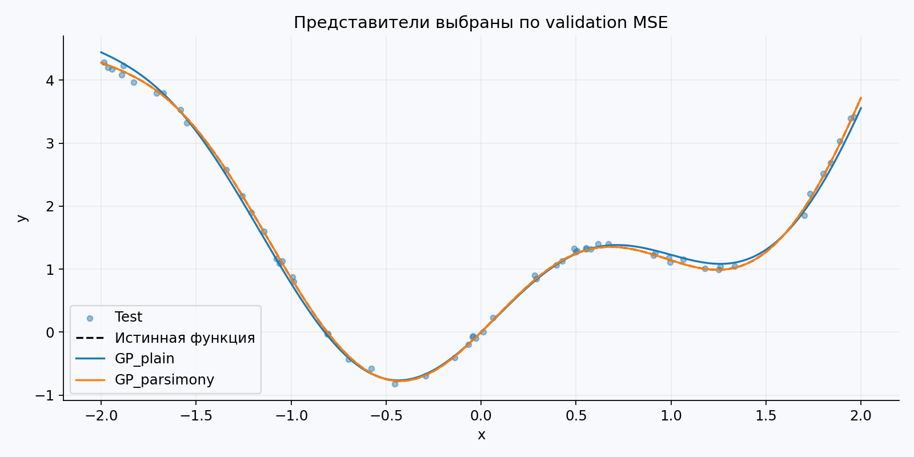

<div align="center">

# Эволюция формул

**Генетическое программирование с контролем разрастания**




</div>

## Что внутри

Самостоятельная реализация эволюционного алгоритма без готовых оптимизаторов.
Исходные данные, реальные результаты серий запусков, графики и отчёт включены.

- [Отчёт и анализ результатов](REPORT.md)
- [Параметры эксперимента](config.json)
- [Результаты всех запусков](results/runs.csv)
- [Сводная статистика](results/summary.csv)

## Установка

Python **3.11+**. Фактически проверено на **Python 3.12.14**, NumPy 2.3.5,
Matplotlib 3.10.8, Linux. Для Windows используются те же исходники и стандартные пути Python.
Матрица GitHub Actions настроена на 3.11–3.14; её наличие не означает, что эти CI-запуски уже выполнены.
GPU, Jupyter и внешние данные не нужны.

Распакуйте архив и откройте терминал **в папке, содержащей `main.py`**.

**Windows / PowerShell:**

```powershell
py -m venv .venv
.venv\Scripts\python.exe -m pip install -r requirements.txt
.venv\Scripts\python.exe main.py --output my_results
.venv\Scripts\python.exe -m unittest discover -s tests -v
```

**Linux / macOS:**

```bash
python3 -m venv .venv
.venv/bin/python -m pip install -r requirements.txt
.venv/bin/python main.py --output my_results
.venv/bin/python -m unittest discover -s tests -v
```

Активация окружения не требуется. В уже подготовленном окружении:

```bash
python main.py --runs 1 --seed 261400 --output results_smoke
python main.py --output my_results
python -m unittest discover -s tests -v
```

Первая команда — проверка запуска, вторая — полная серия **30 запусков каждого метода**.
Без `--output` программа пишет в `results/` и перезаписывает включённые результаты.
При запуске с новыми параметрами `REPORT.md` автоматически не изменяется: это отчёт о приложенной серии.

Для точного окружения экспериментального запуска на Python 3.12 используйте
`requirements-tested.txt`; для остальных поддерживаемых версий — `requirements.txt`.
Установка зависимостей требует интернета, сами эксперименты работают без сети.

## Управление экспериментом

```bash
python main.py --config config.json --runs 30 --seed 261400 --output my_results
```

`--seed` задаёт первый seed: дальше используются последовательные целые числа.
Один и тот же seed у разных методов позволяет сопоставлять запуски; разные seed внутри серии дают независимые потоки генератора.
Время и сведения о платформе могут меняться, численные результаты воспроизводятся в указанном окружении.

## Структура

| Файл / каталог | Назначение |
|---|---|
| `main.py` | Запуск серии, статистика, графики |
| `model.py` | Модель задачи и эволюционные операторы |
| `common.py` | CLI, сохранение CSV/JSON, визуализация |
| `config.json` | Все основные параметры |
| `data/` | Фиксированные входные данные (если нужны) |
| `results/` | CSV, JSON, PNG, журнал эксперимента и тестов |
| `tests/` | Проверки математических свойств и реализации |
| `tests.yml` | Тесты и пробный запуск при push / pull request |


## Источник задания

Р. В. Душкин, «Эволюционное программирование и генетические алгоритмы»,
комплекс лабораторных работ, PDF, предоставленный пользователем.
V = 1 + ((17·14 + 7·0 + 26) mod 20) = 5. Q = 0 для группы 507.

Для явного пересоздания входного набора: `python generate_data.py`. Команда перезаписывает файл в `data/`; при изменении seed данных старый отчёт уже не описывает новый экземпляр.
