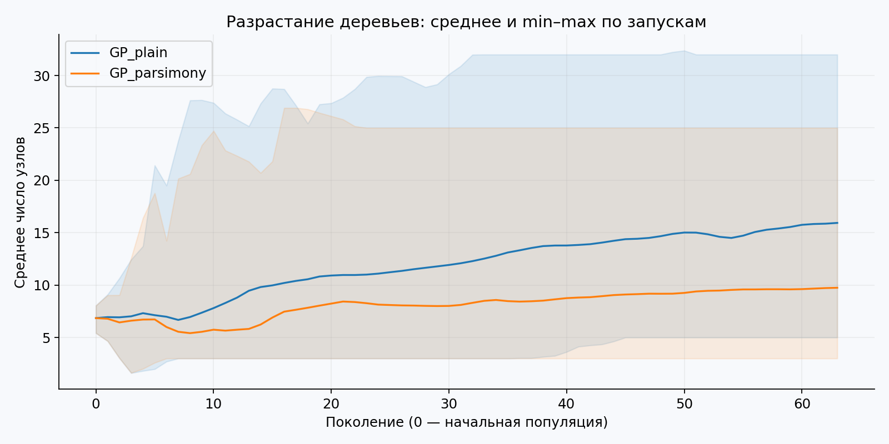
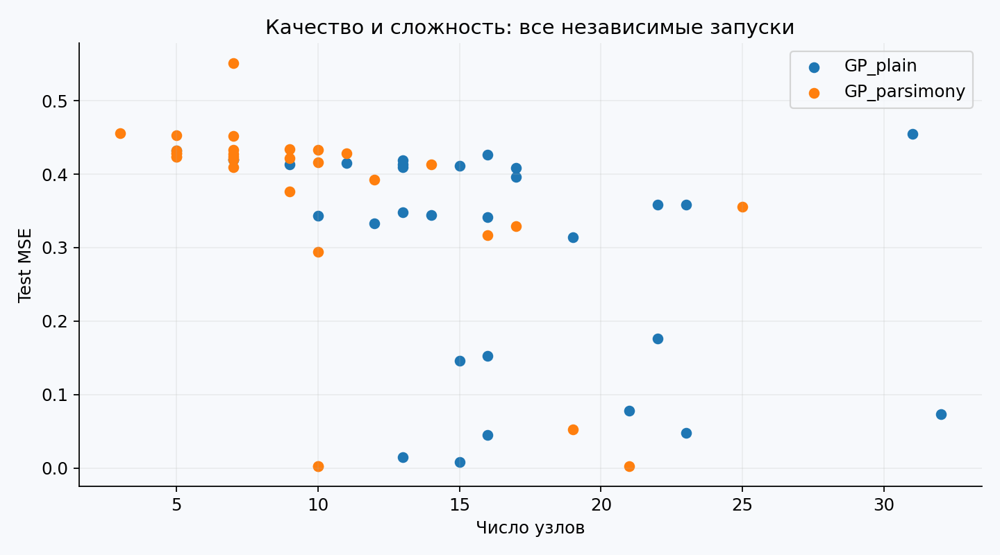
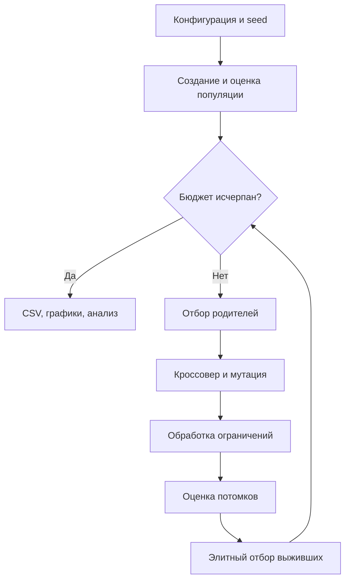

# Лабораторная работа

Эволюционное программирование и генетические алгоритмы  
Группа **507**, порядковый номер **14**, год **2026**.

Индивидуализация: Q=0, Y=26; V=1+((17·14+7·0+26) mod 20)=**5**.

## Постановка и архитектура

Вариант 5: эволюционный поиск формул для символьной регрессии с контролем разрастания деревьев. Компоненты: генератор данных → синтаксические деревья → безопасный интерпретатор → GP → отбор по validation → итоговая test-оценка → анализ качества и сложности.

Данные: 240 наблюдений x∼U[−2,2], y=x²+sin(3x)+ε, ε∼N(0,0.05²), seed=5071426. После генерации случайная перестановка разделяет данные на train=120, validation=60, test=60. Файл `data/regression.csv` фиксирует значения и разбиение. Истинная формула используется только в генераторе и на иллюстрации; инициализация не получает её структуру.

## Представление и корректность

Генотип — неизменяемое дерево-кортеж, фенотип — вектор его значений на x. Терминалы: x и случайные константы из [−2,2], округлённые до 0.001. Операции: +, −, ×, защищённое деление pdiv, sin. При |b|≤10⁻⁶ pdiv(a,b)=1, иначе a/b. После бинарных операций результат ограничивается [−10⁶,10⁶]; поэтому интерпретатор имеет явно ограниченную семантику и не всегда эквивалентен обычной арифметике за пределами исследуемого диапазона. Отчётные формулы используют имя `pdiv`, чтобы это различие не скрывалось.

Арность задаётся словарём ARITY. Скрещивание заменяет произвольное поддерево первого родителя произвольным поддеревом второго. Мутация заменяет поддерево случайным деревом глубины ≤3. Замена возможна и в корне. Потомок принимается только при глубине ≤7 и числе узлов ≤63, иначе сохраняется предыдущий допустимый вариант. Операторы по построению создают синтаксически корректные деревья. Родительские деревья не изменяются.

## Экспериментальный дизайн

Начальные деревья создаются grow-генерацией с пределами глубины 3,4,5 циклически; вероятность раннего терминала 0.25, среди терминалов вероятность x=0.65. Популяция 64, турнир размера 3, кроссовер 0.8 на потомка, мутация 0.25, 63 поколения, элитный отбор 64 из 128.

Два варианта отличаются **только мягким штрафом**:

- GP_plain: score = train MSE.
- GP_parsimony: score = train MSE + 0.003·число узлов.

Оба имеют одинаковые жёсткие пределы. «Без штрафа» не означает полностью неограниченные деревья. Это позволяет изолировать влияние мягкого контроля разрастания.

Каждый запуск: **4096 train-оценок** и **64 validation-оценки** финальной популяции. В test не заглядывают при эволюции и выборе победителя: победитель запуска минимизирует validation MSE, при равенстве — размер. Для каждого метода выполняются **30 независимых запусков**. Сводная статистика учитывает все 30 победителей, а не только лучшую формулу.

Представители на графике предсказаний дополнительно выбираются среди победителей по validation, поэтому это демонстрационные удачные формулы, не оценка среднего качества метода. Дополнительный анализ кандидатов разного размера тоже использует validation; его диагностические обращения не входят в эволюционный бюджет и не влияют на эволюцию или строки `runs.csv`.

Baselines: константа — среднее train; линейная регрессия — МНК с двумя коэффициентами на train. Это дешёвые неэволюционные ориентиры, им не приписывается одинаковая стоимость поиска. Равенство бюджета относится к двум GP. Разные размеры деревьев означают разную цену одной оценки; отдельно сохранено время, а сравнения по равному wall-clock не заявляются.

## Результаты и критическая интерпретация

Среднее test MSE без штрафа — **0.297395**, со штрафом — **0.361125**. Средний размер уменьшился с **15.87** до **9.80** узла, приблизительно на 38.2%, но средняя ошибка выросла приблизительно на 21.4%. Это реальный компромисс, а не победа штрафа по всем показателям.

Лучший отдельный запуск GP_parsimony имеет test MSE **0.002309**, близкую к дисперсии шума 0.0025, но медиана метода равна **0.422766**. Поэтому лучший запуск не отражает типичное качество. Константа дала test MSE **1.999329**, линейная модель — **1.884475**: обе серии GP в среднем значительно лучше этих простых моделей. Восстановление точной формулы во всех запусках не достигнуто.

В `representatives.json` сохранены три эволюционировавших формулы размером 3,18,32 узла. Малая формула x·x пропускает синусоидальную часть (test MSE≈0.4561). Средняя даёт ≈0.04790, большая ≈0.07360: рост числа узлов не гарантирует лучшего обобщения. Представители выбраны по validation отдельно для трёх доступных размеров; тест только сообщается после выбора.






## Ограничения и улучшения

Набор данных один, шум мал, область одномерная; результаты нельзя переносить на все задачи регрессии. Разрастание сдерживается также жёсткими пределами и элитным отбором, поэтому вклад мягкого штрафа изучен только в этой архитектуре. Validation используется многократно для отбора демонстрационных моделей: итоговая неопределённость лучше оценивается повторными разбиениями, а не подбором по test.

Возможные улучшения: адаптивный штраф, Парето-отбор ошибка/размер, алгебраическое упрощение с сохранением защищённой семантики, мутация констант, несколько функций и шумовых уровней. При добавлении локальной подгонки констант её оценки следует учитывать в бюджете.

## Схема процесса



Оценки выживших кешируются: повторного обращения к целевой функции для них нет.
Для случайного baseline вместо отбора родителей и вариации генерируется новая выборка,
а сохраняется лучший найденный допустимый результат.


## Параметры приложенной серии

```json
{
  "population": 64,
  "generations": 63,
  "runs": 30,
  "seed": 261400,
  "data_seed": 5071426,
  "max_depth": 7,
  "max_nodes": 63,
  "penalty": 0.003,
  "crossover_probability": 0.8,
  "mutation_probability": 0.25
}
```

Потоки генератора: seed от 261400 до 261429 включительно.
Независимость относится к запускам на одном фиксированном экземпляре, а не к разным задачам.

## Полная сводная статистика

`std` — выборочное стандартное отклонение, ddof=1. min/max относятся к серии.
Для ошибки меньше — лучше, для полезности больше — лучше; extrema времени не являются показателями качества.

| Метод | Метрика | n | min | Среднее | Медиана | std | max |
|---|---|---|---|---|---|---|---|
| GP_plain | train_mse | 30 | 0.00753289 | 0.286761 | 0.335932 | 0.156234 | 0.520611 |
| GP_plain | validation_mse | 30 | 0.00632528 | 0.302665 | 0.357351 | 0.166551 | 0.548871 |
| GP_plain | test_mse | 30 | 0.00789799 | 0.297395 | 0.353422 | 0.150609 | 0.454844 |
| GP_plain | nodes | 30 | 5 | 15.8667 | 15 | 6.2903 | 32 |
| GP_plain | depth | 30 | 3 | 5.9 | 6 | 1.26899 | 7 |
| GP_plain | seconds | 30 | 0.102882 | 0.197656 | 0.193478 | 0.0621896 | 0.348293 |
| GP_plain | evaluations | 30 | 4096 | 4096 | 4096 | 0 | 4096 |
| GP_parsimony | train_mse | 30 | 0.00290578 | 0.354588 | 0.418781 | 0.146823 | 0.530597 |
| GP_parsimony | validation_mse | 30 | 0.00223112 | 0.375202 | 0.443464 | 0.15468 | 0.537506 |
| GP_parsimony | test_mse | 30 | 0.00230852 | 0.361125 | 0.422766 | 0.145954 | 0.550993 |
| GP_parsimony | nodes | 30 | 3 | 9.8 | 9 | 5.24174 | 25 |
| GP_parsimony | depth | 30 | 2 | 4.63333 | 4 | 1.47352 | 7 |
| GP_parsimony | seconds | 30 | 0.0982964 | 0.166361 | 0.154481 | 0.0571963 | 0.316517 |
| GP_parsimony | evaluations | 30 | 4096 | 4096 | 4096 | 0 | 4096 |

## Проверка и воспроизводимость

В приложенной среде завершились полная серия и `python -m unittest discover -s tests -v`.
Протокол — `results/tests.log`. Исходные строки — `runs.csv`, промежуточные траектории —
`histories.csv`, параметры — `used_config.json`, версии — `environment.json`.
Время измерялось на общей машине с параллельно выполнявшимися независимыми экспериментами;
оно ориентировочное и не используется как основание превосходства методов.

Сравнивались средние, медианы и разбросы. Проверка статистической значимости не проводилась;
слова «лучше» в отчёте относятся к наблюдаемой серии, а не к доказанному универсальному превосходству.


